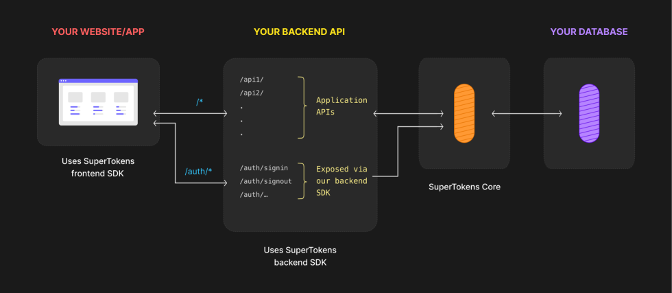

# Lokaly postmortem

---

## 🫶🏻 Solid.js

- React-like but better
  - Component hierarchy independent perf (aka fine-grained reactivity)
  - reactive signal with auto-tracking dep

```js
/* react */
const [a, setA] = useState(42);
const c = useMemo(() => a + b, [a, b]);
/* solid */
const [a, setA] = createSignal(42);
const c = createMemo(() => a() + b());
```

- Mature ecosystem
  - Good headless component libraries (Kobalt, Tanstack form/query, ArkUI)
  - Easy vanilla integration (Mapbox, supertoken sdk, capacitor APIs)

---

## Tailwind

- Easy to remember/curated subset of CSS
- Great co-location of style and markup + No cascading effect
- 👎 don't use plugins
  - marginal use cases (fluid scale typo + fluid scale size)
  - can block migration to major version (V3 -> V4)

```html
<div
  class="flex flex-col justify-between gap-6 border-t border-light-10 py-10 text-grey-600 text-xs sm:flex-row"
>
  <p class="order-2 sm:order-1">{t('footer.copyright')}</p>
  <div
    class="order-1 flex flex-col gap-4 sm:order-2 sm:flex-row sm:gap-6"
  ></div>
</div>
```

---

## Telefunc

- RPC - Remote Procedure Call
- Expose typescript function as API endpoint
- Generates typeguard based on signature
- 👍 Simple, typesafe, minimal abstraction
- 🤔 Maybe not a good fit for later SSR

```ts
// foo.telefunc.ts
export async function foo(input: TypeA): Promise<TypeB> {
  const { ip, logger } = getContext()

// foo.tsx
import { foo } from "./foo.telefunc"
```

---

## Postgres

- 👍 JSONB, PostGIS
- 👎 Large Object
  - Only transactionnal not relationnal
  - cannot be filter out when using pg_basebackup
  - S3 migration ?
- good postgresql.conf is non-trivial

```shell
listen_addresses = '*'
shared_buffers = 4GB
effective_cache_size = 8GB
work_mem = 32MB
effective_io_concurrency = 10
archive_mode = on
archive_command = '/etc/postgresql/archive_command.sh %p %f'
archive_timeout = 3600s
wal_keep_size = 10GB
hba_file = '/etc/postgresql/pg_hba.conf'
```

[https://byteofdev.com/posts/making-postgres-slow/]()

---

## Drizzle

<div class="columns">
<div>

- 👍 Declarative schema definition
- Handles migrations
- 👍 Type safety in TS-land
  - Query api syntax (ORM-like)
  - SQL-like syntax (Query builder)
  - Raw SQL escape in both mode
- SQL flavors well integrated
- subqueries, prepared statements, materialized view, transactions...

</div>
<div>

```ts
const existingPoi = await tx.query.pointOfInterest.findFirst({
  columns: {
    id: true,
    status: true,
  },
  extras(fields) {
    return {
      label: sql<string>`${fields.label} ->> ${lang}`.as('label'),
    }
  },
  where(fields, ops) {
    return ops.and(
      ops.eq(fields.id, params.poiId as PoiId),
      ops.eq(fields.status, 'in-review'),
    )
  },
  with: {
    orgs: {
      with: {
        org: {
          columns: {
            approved: true,
          },
          with: {
            users: {
              with: {
                user: {
                  columns: {
                    email: true,
                    firstName: true,
                    lastName: true,
                  },
                },
              },
            },
          },
        },
      },
    },
  },
})
// ...

const poiThemeScore = db.$with("poi_theme_score").as((qb) => {
  return qb
    .select({
      theme: sql<ThemeName>`${schema.poisToThemes.themeName}`.as("theme"),
      score:
        sql<number>`SUM(CASE ${schema.userTracking.event} WHEN 'add_fav_poi' THEN 3 WHEN 'remove_fav_poi' THEN -3 WHEN 'view_detail_poi' THEN 1 ELSE 0 END)`.as(
          "score"
        ),
    })
    .from(schema.userTracking)
    .innerJoin(
      schema.poisToThemes,
      eq(schema.userTracking.poiId, schema.poisToThemes.poiId)
    )
    .where(
      and(
        eq(schema.userTracking.userId, sql.placeholder("userId")),
        inArray(schema.userTracking.event, [...TRACKING_EVENTS_POI])
      )
    )
    .groupBy(schema.poisToThemes.themeName);
});
```

</div>
</div>

---

## Prerender

*Chromium webservice to render SPA app (full JS) into static HTML for SEO*

- Middleware redirect bots to it for SEO
- 🤔 Functionnality OK
- ☠️ Operationnal hell
  - 50% of request ends 503 no idea why

Future => Real SSR ? SolidStart / TanstackStart ?

---

## Capacitor

*Hybrid app that packages an SPA into a native app using webviews*

- "detached mode" only
  - No vendorlocking because of wrapper hell
  - iOS store / toolchain is stupid
- Good sets of core "plugins" (almost no 3rd party required)
- ❤️ **@capgo/capacitor-updater**
  - OTA update plugin
  - Self hosted server
  - Possible to write own update logic

---

## Supertokens



- 👌 works well overall
- Some feature in paid tier "hacked" :
  - Multi-realm => one instance per env 
  - Unified login => join table app-land
- Next project => **better-auth** ?

---

## DevOps

*Client fully onboard with open-source / self-hosted (too much ?)*

### Docker compose on single VPS

- Simple mental model
- With companion shell script for rolling deployement
- Still a lot of margin for vertical scaling 

### Docker swarm on multiple VPS

- More complex mental model
- Many differences in compose file specs
- Not used to full potential
- Using mounted volume for bloc storage ain't ideal

---

## Monitoring

- Tried **open-telemetry** too early, then gave up
- Client took over and added **Zabbix** to VPS
- **Posthog** for product analytics (very good free tier)
- Lacks logs collection (**ELK** stack ?)

## Tests

- Bootstraped **OpenContainer** for integration test
- Currently none 😓

## Mailing

- **Brevo** => OK-tier
- ⚠️ too complex template, html limit on email clients

---

# That's all folks
