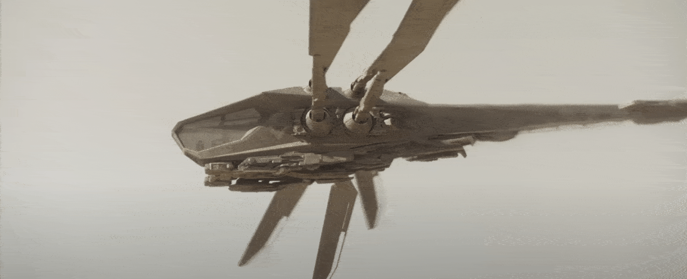
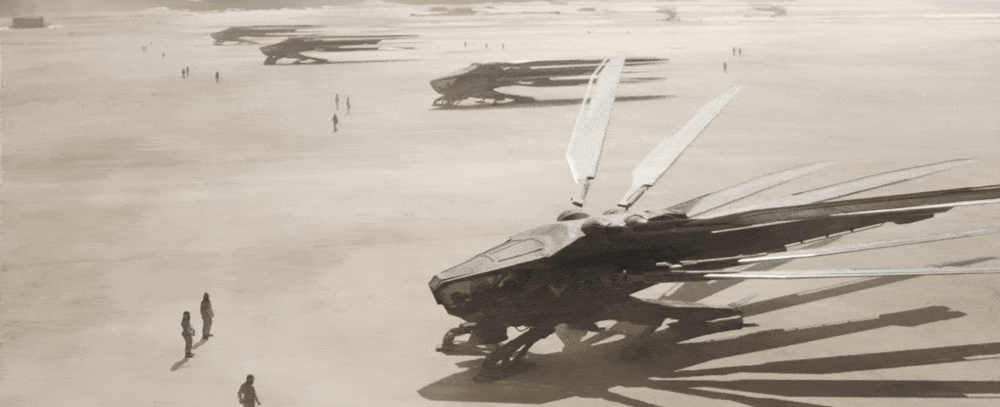
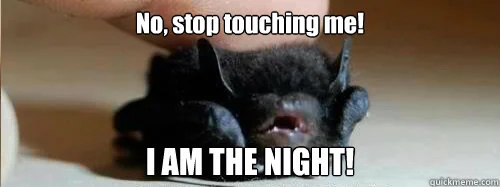
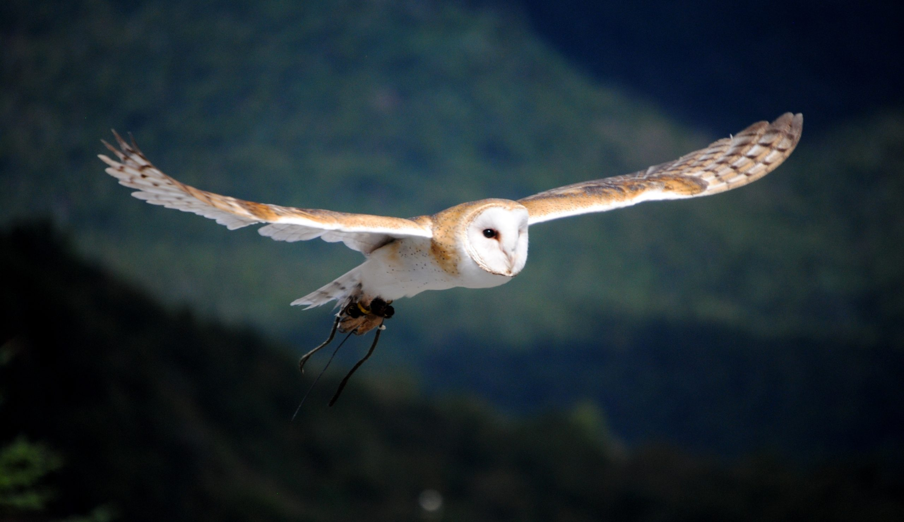
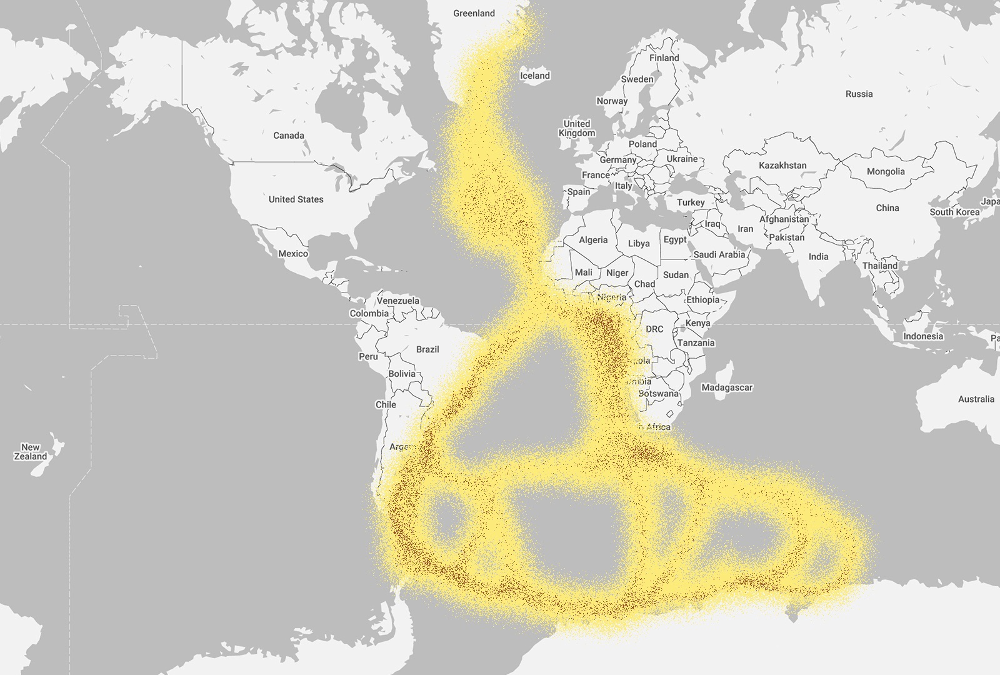
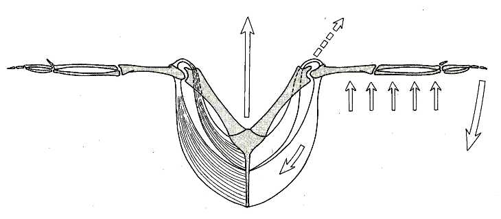
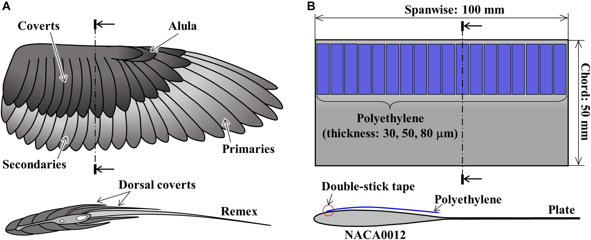
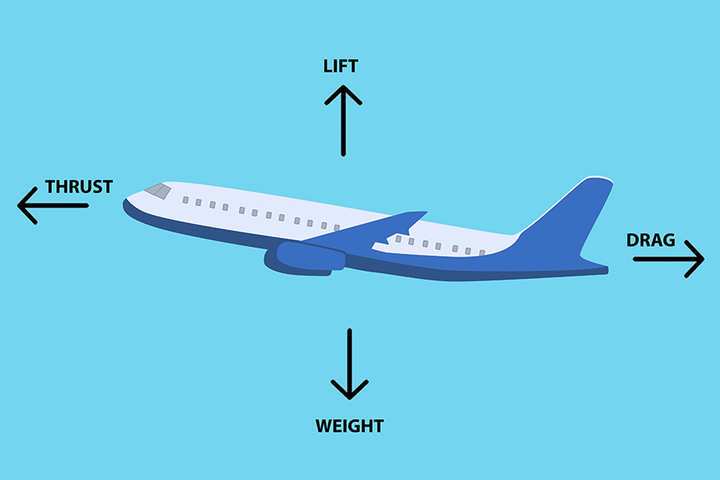
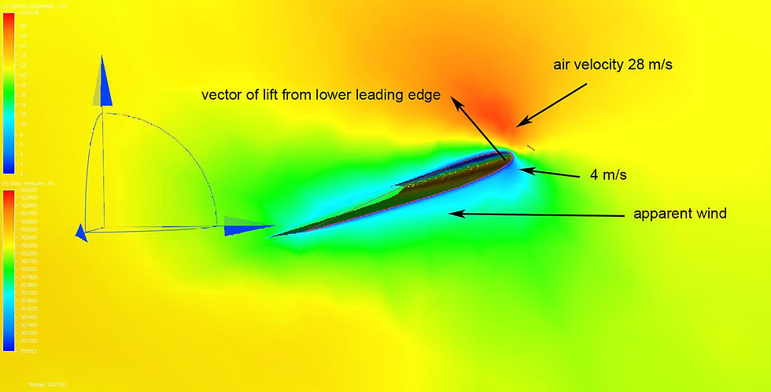

# Ornithoptère

---

## Pourquoi s'intéresser aux Ornithoptères ?

* Dune
* En RC, c'est plus simple qu'à l'échelle 1
* Approche biomimétique intéressante
* Essaient de reproduire le vol des oiseaux (et ses avantages).

---

## Apparitions Indépendantes du Vol

La capacité de voler est apparue plusieurs fois indépendamment au cours de l'évolution :

* Insectes
* Reptiles
  * Ptérosaures 
  * Dinosaures Théropodes (oiseaux)
* Mammifères (chauves-souris)
* Convergence évolutive

---

## Pourquoi s'intéresser au Vol des Oiseaux ?

* Les oiseaux sont les seuls dinosaures qui ont survécu K/Pg, respect.
  
<!-- Crétacé/Paléogène (K/Pg) -->

---

## Pourquoi s'intéresser au Vol des Oiseaux ?

- Les oiseaux sont les seuls dinosaures qui ont survécu K/Pg, respect.
* Avantages à reproduire :
  * est silencieux (cf chouette, hibou)
  * est très économe en énergie (cf sterne arctique, migration de 38 000 km, 800.000 km dans sa vie)
    * ou pas (cf colibri)
  * Haute manoeuvrabilité (atterissage/décollage, chasse, buttinage)

---

## Anatomie des oiseaux

* Os pneumatiques
* Os soudés pour une meilleure rigidité en vol
* Énormes muscles pectoraux (30% de la masse de l'oiseau)
* Respiration en 2 temps pour une oxygénation continue

---

## Les quatre forces en jeu

* Poids / Gravité (Weight, Gravity)
* Portance (Lift)
* Traînée (Drag)
* Poussée (Thrust)

## Comment créer de la portance ?

* Avec une simple planche (sans cambre)
* La portance dépend de l'angle d'attaque
* ~~Le principe de Bernoulli~~
  * Les molécules d'air pas liées entre elles!

---

## Comment Créer de la Poussée

* _Avion_ : poussée et portance, générées par deux éléments distincts
* _hélicoptère/drone_ un seul élément produit les deux
* Dans le monde animal, pas d'hélices
* La poussée est créée en battant des ailes

---

### Le flagellum

@[youtube](https://www.youtube.com/watch?v=dYt5135_0bs)

---

## Études Biomécaniques

* Films au ralenti de vol d'oiseaux (Eadweard Muybridge 1890s)
* Des méthodes plus intrusive [cf article](https://journals.biologists.com/jeb/article/210/18/3135/17027/Biomechanics-of-bird-flight)

---

### Motion capture sur animaux vivants (ou morts)

@[youtube](https://www.youtube.com/watch?v=23X-zTTrfgQ&t=407s)

---

### Études aérodynamiques pour visualiser les flux d'air

@[youtube](https://www.youtube.com/watch?v=2sh8_3-R90I&t=41s)

---

### Simulations CFD (Continuous Fluid Dynamics)

@[youtube](https://www.youtube.com/watch?v=PCj-82oYgUs)

---

## Tuto : accéder à des articles de recherches

1) Utiliser [Google Scholar](https://scholar.google.com/scholar?hl=en&as_sdt=0%2C5&q=airfoil+bird&btnG=)
2) Copier la ref
3) Utiliser 🏴‍☠️ [Sci-hub](https://sci-hub.st)

---

## Design et Technique de Construction d'Ornithoptères

* Moteurs
  * Moteur à élastique
  * Électrique (brushless, brushed...)
  * Thermique (rare, rendement moindre que l'électrique)

<!-- mentionner les frères Wright et les concours de freeflight) -->

---

### Stockage d'énergie :

Storage Medium   | Energy Density (Wh/g)
-----------------|----------------------
Rubber 	  	     | 0.007
Battery, NiCd    | 0.04
Battery, NiMH    | 0.07
Battery, Li-poly | 0.14
Nitromethane     | 3.3
Methanol         | 6.4
Fat              | 10.5
Gasoline         | 12.2

---

## Design et Technique de Construction d'Ornithoptères

- Moteurs & stockage d'énergie
* Boîte de vitesse : dimensionner pour avoir un couple et une vitesse de rotation correcte
* Mécanisme de battement : transforme le mouvement circulaire continu en mouvement oscillant
  * Les ornithoptères sont soumis à de plus grands stress mécaniques que les ailes fixes
* Ailes à membranes : les plus simples, la déformation repose sur des propriétés aéroélastiques passives

---

## Exemples de Designs Intéressants

* [Festo Ornithopter](https://www.festo.com/fr/fr/e/a-propos-de-festo/recherche-et-developpement/bionic-learning-network/faits-marquants-2018-2021/bionicswift-id_326830/)
  * Bionic Swift : capable de vol en nuée
  * Autres modèles : SmartBird (albatros), Bionic FlyingFox (chauve-souris), BionicOpter (libellule), eMotionButterflies, BionicBee

* [Vidéo de démonstration](https://youtu.be/grAJrSlG1-E?si=11iYlIbQ0bpJUnoe&t=18) : pas d'aile mais une queue battante comme les dauphins

* [Delfly](https://www.delfly.nl/)
  * Inspiré du vol des mouches / colibris
  * Ailes verticales
  * Contrôle yaw/pitch/roll via le dièdre et le twist des ailes

---
